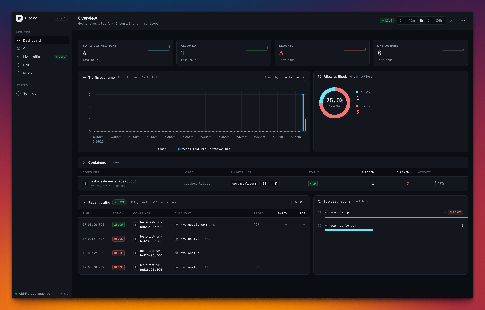
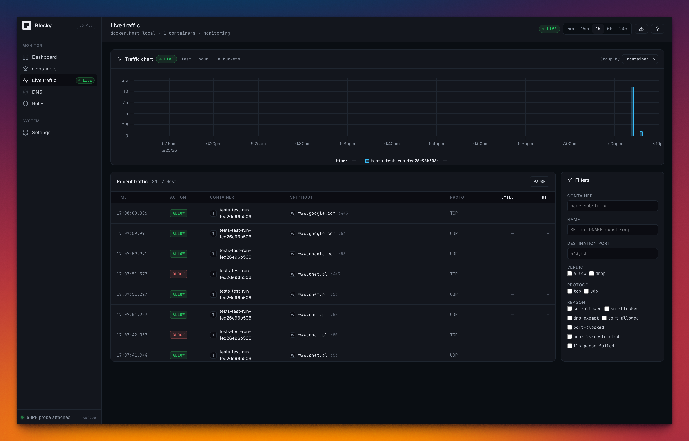
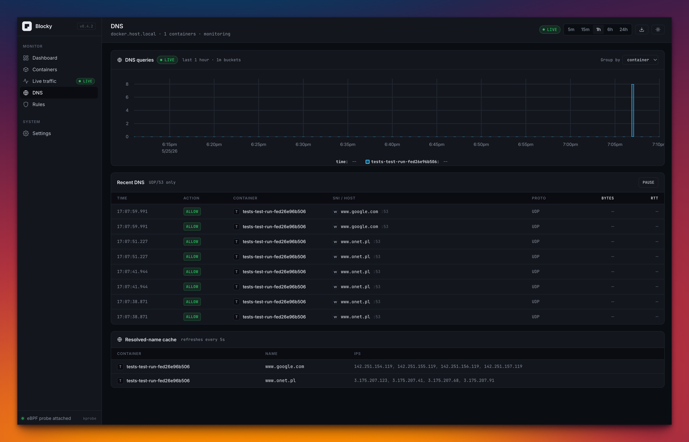

<h1 align="center">Blocky</h1>

<p align="center">
  <b>Per-container egress firewall for Docker.</b><br/>
  eBPF-enforced, label-driven, TLS-SNI aware.
</p>

<p align="center">
  <a href="LICENSE"></a>
  
  
  
</p>

<p align="center">
  
</p>

> [!IMPORTANT]
> Blocky was developed with substantial AI assistance and is offered as-is for
> experimentation. **Do not run it in production.**

---

## Overview

Blocky locks down what your Docker containers are allowed to reach on the
network, without modifying the workload, terminating TLS, or routing traffic
through a userspace proxy. An eBPF program is attached to each container's
host-side veth and decides — per flow, in-kernel — whether the packet may
leave the host.

Policy is expressed entirely through Docker labels. The model is inspired by
Cilium's FQDN policy, scaled down to fit a single-host Docker workflow.

Typical use cases:

- Running third-party container images you don't fully trust.
- Auditing the egress footprint of a service before tightening its policy.
- Hardening CI runners, build agents, or sandboxed tooling.

## Features

- **Label-driven policy.** No sidecars, no daemon-set, no DSL. Three labels.
- **TLS SNI allow-listing** on tcp/443 without TLS termination.
- **L4 port allow-listing** for everything else.
- **Observe-only mode** for discovery before lockdown.
- **In-kernel enforcement** via TCX (Linux ≥ 6.6) or classic TC (≥ 5.10), CO-RE compiled.
- **Live dashboard and WebSocket tap** of every new outbound flow, per container.
- **DNS-aware events** — SNI and DNS QNAME share a single event stream.

## How it works

Blocky watches the Docker event stream. For each container labelled
`blocky.enabled=true`:

1. The reconciler resolves the host-side end of the container's veth pair.
2. A CO-RE eBPF program is attached on the egress hook (TCX where available,
   classic TC otherwise).
3. The program parses the TLS ClientHello on tcp/443 to extract SNI, falls
   back to the port allow-list for other traffic, and consults a
   connection-tracking map so only the first packet of each flow incurs full
   inspection.
4. Verdicts are emitted to userspace via a BPF ring buffer and surfaced over
   the HTTP and WebSocket API, and on the bundled dashboard.

## Requirements

- Linux kernel ≥ 6.6 (TCX) or ≥ 5.10 (classic TC fallback).
- BTF available at `/sys/kernel/btf/vmlinux` at runtime (CO-RE relocations).
- Build toolchain: `clang`, `libbpf-dev` — installed by `task install:prereqs`.
  `vmlinux.h` is vendored per-arch under `internal/bpf/headers/`, refreshed
  with `task refresh:vmlinux`.
- Runtime capabilities: `CAP_BPF`, `CAP_NET_ADMIN`, `CAP_SYS_ADMIN`.

## Quick start

```sh
# One-time: install build prerequisites.
task install:prereqs

# Generate BPF bindings, templ, and tailwind output.
task gen

# Build the binary.
task build

# Start the daemon.
sudo BLOCKY_LOG_FORMAT=console ./blocky run

# In a separate shell, follow live verdicts...
./blocky tap --format pretty

# ...or open the dashboard.
open http://localhost:8080/
```

### Running in Docker

```sh
# Build the image and start the daemon. vmlinux.h is vendored, so the build
# is self-contained — no host BTF is read at build time.
docker compose up -d --build
```

The compose file runs with `network_mode: host`, `pid: host`, and
`privileged: true` so the daemon can attach BPF programs to other
containers' host-side veths. The Docker socket, `/sys/kernel/btf`, and
`/sys/fs/bpf` are bind-mounted in. See `compose.yaml` for the explicit
capability list if you want to drop `privileged`.

## Labels

`blocky.enabled=true` is the opt-in marker. Without it, the container is
ignored entirely — no BPF attach, no dashboard entry, no events. The two
rule labels compose independently on top of `enabled`.

| Label                            | Description                                                                                                                  |
| -------------------------------- | ---------------------------------------------------------------------------------------------------------------------------- |
| `blocky.enabled`                 | Required opt-in. Accepts `true`, `1`, `yes`, `on` (case-insensitive). Anything else means the container is not managed.      |
| `blocky.allowed-https-domains`   | TLS-SNI allow-list for tcp/443. Comma-separated exact names. Max 16 exact + 16 suffix entries, each ≤ 31 bytes.               |
| `blocky.allowed-ports`           | L4 destination-port allow-list. Comma-separated. Max 16 ports. **53 and 443 must be listed explicitly if needed.**            |

### Policy modes

Assumes `blocky.enabled=true`. Without it, the row does not exist as far as
blocky is concerned.

| `allowed-https-domains` | `allowed-ports` | Behaviour                                                                                                                        |
| ----------------------- | --------------- | -------------------------------------------------------------------------------------------------------------------------------- |
| absent                  | absent          | **Observe-only.** BPF attached, every flow allowed, every flow emitted. Use this to see what a container does before locking it down. |
| set                     | absent          | **Legacy mode.** DNS (udp+tcp/53) exempt; tcp/443 must match SNI; everything else dropped.                                       |
| absent                  | set             | **Port-only mode.** Port in list ⇒ allowed (any payload); not in list ⇒ dropped. No SNI parsing.                                 |
| set                     | set             | Port allow-list gates first. On tcp/443, SNI must also match. Other allowed ports pass without L7 inspection.                    |

For any container under one of the policy modes above, the tap emits one
event per **new** outbound flow. Subsequent packets of an established flow
are short-circuited by the connection-tracking map and don't re-emit.

> Wildcard suffix matching (`*.example.com`) is parsed and stored correctly
> but the kernel-side matcher is currently a no-op pending a hash-based
> rewrite — see [Roadmap](#roadmap). Exact match works.

## Examples

```sh
# Observe-only: BPF attached, nothing dropped, every flow visible in the UI.
docker run --rm \
  --label blocky.enabled=true \
  --dns=8.8.8.8 alpine/curl -sSf https://anything.example.com
```

```sh
# SNI allow-list only (legacy mode).
docker run --rm \
  --label blocky.enabled=true \
  --label blocky.allowed-https-domains=www.google.com \
  alpine/curl -sSf https://www.google.com   # succeeds

docker run --rm \
  --label blocky.enabled=true \
  --label blocky.allowed-https-domains=www.google.com \
  alpine/curl -sSf https://www.bing.com     # fails (SNI mismatch)
```

```sh
# Port-only allow-list — any HTTPS site reachable, no SNI inspection.
docker run --rm \
  --label blocky.enabled=true \
  --label blocky.allowed-ports=53,443 \
  --dns=8.8.8.8 alpine/curl -sSf https://www.bing.com
```

```sh
# Combined: ports gate everything; SNI also restricts tcp/443.
docker run --rm \
  --label blocky.enabled=true \
  --label blocky.allowed-ports=53,443 \
  --label blocky.allowed-https-domains=www.google.com \
  --dns=8.8.8.8 alpine/curl -sSf https://www.google.com   # succeeds

docker run --rm \
  --label blocky.enabled=true \
  --label blocky.allowed-ports=53,443 \
  --label blocky.allowed-https-domains=www.google.com \
  --dns=8.8.8.8 alpine/curl -sSf https://www.bing.com     # fails (SNI mismatch)
```

## CLI

```
blocky run        Start the daemon.
blocky tap        Stream live flow events from a running daemon.
blocky version    Print build information.
```

Run `blocky <command> --help` for flags.

## HTTP API

The daemon listens on `BLOCKY_API_ADDR` (default `0.0.0.0:8080`) and serves
the REST API, the WebSocket tap, and the dashboard.

| Method | Path                  | Description                                                              |
| ------ | --------------------- | ------------------------------------------------------------------------ |
| GET    | `/v1/health`          | Health probe.                                                            |
| GET    | `/v1/containers`      | List known containers and their policies.                                |
| GET    | `/v1/containers/{id}` | Single-container detail.                                                 |
| GET    | `/v1/tap`             | WebSocket; per-flow events. Query params: `container=`, `verdict=allow\|drop`. |

Tap events carry a single `name` field that holds the TLS SNI (for tcp/443)
or the DNS QNAME (for udp/53) — so `blocky tap` shows both what was
resolved and what was connected to for the same container.

<p align="center">
  
</p>

<p align="center">
  
</p>

## Configuration

All configuration is via environment variables.

| Variable                         | Default                       | Description                                  |
| -------------------------------- | ----------------------------- | -------------------------------------------- |
| `BLOCKY_API_ADDR`                | `0.0.0.0:8080`                | Listen address for the HTTP/WebSocket API.   |
| `BLOCKY_LOG_LEVEL`               | `info`                        | `debug`, `info`, `warn`, `error`.            |
| `BLOCKY_LOG_FORMAT`              | `json`                        | `json` or `console`.                         |
| `BLOCKY_DOCKER_HOST`             | `unix:///var/run/docker.sock` | Docker daemon endpoint.                      |
| `BLOCKY_MAX_RULES_PER_CONTAINER` | `16`                          | Cap on rules per container.                  |
| `BLOCKY_CT_MAP_SIZE`             | `16384`                       | Connection-tracking map capacity.            |
| `BLOCKY_DNS_CACHE_PER_CONTAINER` | `1024`                        | Per-container DNS cache size.                |

## Building from source

The Go module is named `blocky`. To vendor it under your own path, update
`go.mod` and the `PKG` variable in `Taskfile.yaml`.

## Roadmap

Out of scope today, possibly later:

- BPF suffix matching (currently a no-op; planned rewrite using fnv1a
  hashes of dot-anchored tails to fit the verifier budget).
- IPv6.
- HTTP (port 80) Host-header inspection.
- DNS proxy / IP learning for arbitrary FQDNs (Cilium-style).
- Multi-host mode.
- API-driven rule mutation (labels are currently the only source).
- Hostnames longer than 31 bytes (constrained by the BPF stack-buffer cap).

## License

Apache License 2.0. See [LICENSE](LICENSE).
